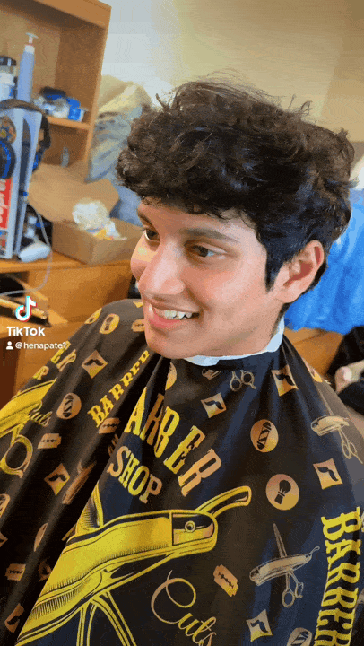

# ✂️ Mael Cutzz – Barber Scheduling Website

## About
My freshman-year roommate at college is an incredible barber who even ran his business from our dorm. I built this website to help promote his brand and make it easy for clients to book appointments directly into his Google Calendar with live availability.

---

## 🌐 Live Website
[mael-cutz.com](https://mael-cutz.com)

---

## 🛠️ Run Locally

### 1. Clone the repository
```bash
git clone https://github.com/your-username/maelcutzz.git
cd maelcutzz
```

### 2. Install backend dependencies
```bash
cd backend
npm install
```

### 3. Add Google Calendar credentials

1. Go to [Google Cloud Console](https://console.cloud.google.com/)
2. Enable the **Google Calendar API**
3. Create a **service account** with calendar access
4. Share the Google Calendar with that service account email (with "Make changes to events" permission)
5. Download the `credentials.json` file
6. Place it in the following directory:
   ```
   backend/config/credentials.json
   ```

> ⚠️ Be sure **not to commit `credentials.json`** to your repo. Add it to `.gitignore`.

### 4. Update Calendar ID in `index.js`
Open `backend/index.js` and update the following line:
```js
const calendarId = 'your-calendar-id@group.calendar.google.com';
```

### 5. Start the backend server
```bash
node index.js
```

### 6. Run frontend
You can now open `index.html` in your browser to test the website locally.

---

## My Haircut! LOL



---

## License
MIT
